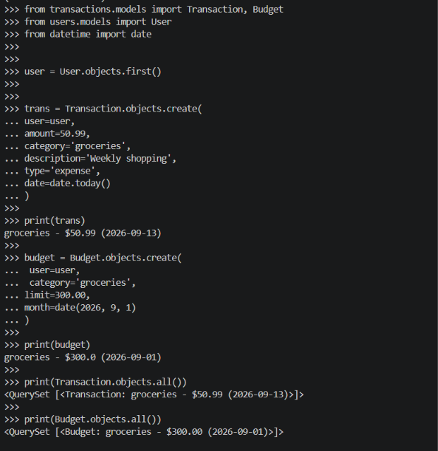

# Day 2: Transaction & Budget Models

## ✅ What I Built

- Transaction model (7 fields) - track income/expenses
- Budget model - monthly spending limits  
- Admin registration with filters/search
- Full tested and working in Django shell

## 🔧 Transaction Model Fields

1. **user** - ForeignKey to User (CASCADE on delete)
2. **amount** - DecimalField (10 digits, 2 decimals) for money precision
3. **category** - CharField (max 50) - type of transaction
4. **description** - TextField (optional) - extra details
5. **type** - CharField with choices (income/expense)
6. **date** - DateField - when transaction happened
7. **created_at** - DateTimeField (auto_now_add) - recording time

## 🔧 Budget Model Fields

1. **user** - ForeignKey to User (CASCADE on delete)
2. **category** - CharField - budget category
3. **limit** - DecimalField - monthly spending limit
4. **month** - DateField - which month
5. **updated_at** - DateTimeField (auto_now) - last modified

## 📊 Key Features

- DecimalField NOT FloatField for money (precision!)
- TRANSACTION_TYPES choices (income/expense dropdown in admin)
- unique_together on Budget (no duplicate budgets per user/category/month)
- __str__ methods for readable displays
- Admin filters and search fields
- Proper ordering (newest first)

## 🧪 Testing

Tested in Django shell:
- Created Transaction: groceries - $50.99 (2026-09-13) ✅
- Created Budget: groceries - $300.00 (2026-09-01) ✅
- QuerySets working perfectly ✅

## 📸 Screenshot

## 🎓 Key Learnings

1. **ForeignKey relationships** - Link models together
2. **DecimalField vs FloatField** - Precision matters for money
3. **Choices in Django** - Restrict field values
4. **auto_now vs auto_now_add** - Different timestamp behaviors
5. **unique_together** - Database constraints for data integrity
6. **Admin customization** - list_display, list_filter, search_fields

## ✅ Day 2 Complete!