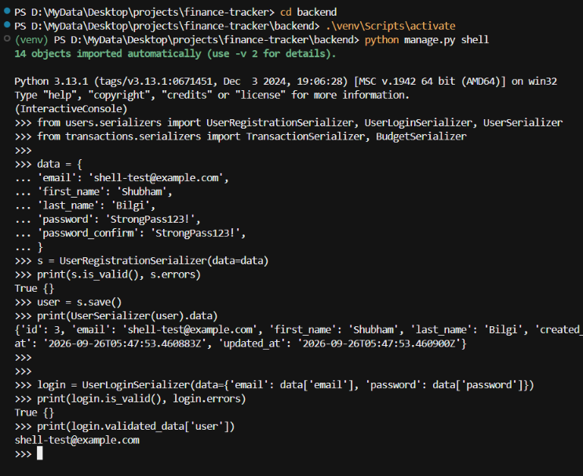

# Day 3: API Serializers

## What I Built Today

- `UserSerializer` — read/update profile JSON (no password)
- `UserRegistrationSerializer` — signup with hashed password
- `UserLoginSerializer` — email + password validation
- `TransactionSerializer` — income/expense payload validation
- `BudgetSerializer` — monthly category limits
- Django shell tests (valid + invalid cases)
- `backend/requirements.txt`

**Files created:**
- `backend/users/serializers.py`
- `backend/transactions/serializers.py`
- `backend/requirements.txt`

---

## What Serializers Do

Models store Python objects in the database. The frontend (and Postman) speak JSON.

A serializer is the translation layer:

```
Model instance  →  Serializer  →  JSON (response)
JSON request    →  Serializer  →  validated data / Model instance
```

Django REST Framework (`ModelSerializer`) maps model fields automatically. Extra `validate_*` methods add business rules the database cannot express clearly (password match, amount > 0).

JWT tokens are **not** issued here. Login only checks credentials. Token generation is Day 5.

---

## Serializer Map

| Serializer | Type | Purpose |
|------------|------|---------|
| `UserSerializer` | ModelSerializer | Profile read/update |
| `UserRegistrationSerializer` | ModelSerializer | Create user, hash password |
| `UserLoginSerializer` | Serializer | Authenticate email + password |
| `TransactionSerializer` | ModelSerializer | Transaction CRUD payloads |
| `BudgetSerializer` | ModelSerializer | Budget CRUD payloads |

---

## Code Breakdown

### UserSerializer

```python
class UserSerializer(serializers.ModelSerializer):
    class Meta:
        model = User
        fields = ('id', 'email', 'first_name', 'last_name', 'created_at', 'updated_at')
        read_only_fields = ('id', 'email', 'created_at', 'updated_at')
```

- Password is omitted on purpose
- Email is read-only so a client cannot swap accounts via a profile PATCH

### UserRegistrationSerializer

- `password` and `password_confirm` are `write_only` (never returned in JSON)
- `validate()` requires both passwords to match, then runs Django's `validate_password`
- `create()` pops confirm, then calls `User.objects.create_user()` so the hash is stored
- `username` is set to the email because `AbstractUser` still requires a unique username

### UserLoginSerializer

- Looks up the user by email (case-insensitive) and calls `check_password`
- Failed login returns a generic "Invalid email or password" (no user-enumeration leak)
- On success, `validated_data['user']` is the authenticated instance for Day 4/5 views

### TransactionSerializer

- `user` is a primary key (ViewSets will later set this from `request.user`)
- `amount` must be greater than 0
- `type` is limited to `income` / `expense` (model choices)
- `created_at` is read-only

### BudgetSerializer

- `limit` must be greater than 0
- Duplicate `(user, category, month)` is rejected (`unique_together` on the model)

---

## Example JSON

### Registration request

```json
{
  "email": "shubham@example.com",
  "first_name": "Shubham",
  "last_name": "Bilgi",
  "password": "StrongPass123!",
  "password_confirm": "StrongPass123!"
}
```

### User response (password never present)

```json
{
  "id": 3,
  "email": "day3-serializer@example.com",
  "first_name": "Shubham",
  "last_name": "Bilgi",
  "created_at": "2026-09-26T05:40:47.395259Z",
  "updated_at": "2026-09-26T05:40:47.395269Z"
}
```

### Transaction (expense)

```json
{
  "id": 3,
  "user": 3,
  "amount": "50.99",
  "category": "groceries",
  "description": "Weekly shop",
  "type": "expense",
  "date": "2026-09-13",
  "created_at": "2026-09-26T05:40:49.152507Z"
}
```

`amount` is a string in JSON so cents stay exact (`DecimalField`, not `float`).

### Budget

```json
{
  "id": 2,
  "user": 3,
  "category": "groceries",
  "limit": "300.00",
  "month": "2026-09-01",
  "updated_at": "2026-09-26T05:40:49.161617Z"
}
```

---

## Testing in Django / Python

From `backend/` with the venv active:

```python
python manage.py shell
```

```python
from users.serializers import UserRegistrationSerializer, UserLoginSerializer, UserSerializer
from transactions.serializers import TransactionSerializer, BudgetSerializer

data = {
    'email': 'shell-test@example.com',
    'first_name': 'Shubham',
    'last_name': 'Bilgi',
    'password': 'StrongPass123!',
    'password_confirm': 'StrongPass123!',
}
s = UserRegistrationSerializer(data=data)
s.is_valid()          # True
user = s.save()
UserSerializer(user).data

login = UserLoginSerializer(data={'email': data['email'], 'password': data['password']})
login.is_valid()      # True
login.validated_data['user']
```

## Screenshot



What this shows:
- `UserRegistrationSerializer` valid (`True {}`)
- User saved: `id=3`, `shell-test@example.com`, password not in JSON
- `UserLoginSerializer` valid (`True {}`)
- Authenticated user prints as `shell-test@example.com`

Cases to try in the shell:

| # | Case | Result |
|---|------|--------|
| 1 | Register valid user | Created, password hashed |
| 2 | Password mismatch | `password_confirm` error |
| 3 | Duplicate email | unique email error |
| 4 | Login correct password | `user` in validated_data |
| 5 | Login wrong password | Invalid email or password |
| 6 | Income + expense | JSON includes amount as `"2500.00"` / `"50.99"` |
| 7 | Amount `0.00` | Amount must be greater than 0 |
| 8 | Type `transfer` | not a valid choice |
| 9 | Valid budget | groceries $300 for 2026-09-01 |
| 10 | Duplicate budget | unique set (user, category, month) |
| 11 | Negative limit | Budget limit must be greater than 0 |

---

## Issues & Solutions

### TypeError: multiple values for keyword argument `email`

`create()` passed `email=email` **and** `**validated_data` which still contained `email`.

**Fix:** `email = validated_data.pop('email')` before `create_user(...)`.

### Username still required on AbstractUser

`User` extends `AbstractUser` but `USERNAME_FIELD` is not set to `email` yet. Registration would fail unique-username checks.

**Fix:** set `username=email` in `create_user`. Switching `USERNAME_FIELD` remains a later auth cleanup (Day 5).

---

## Day 3 Checklist

- [x] `UserSerializer`
- [x] `UserRegistrationSerializer`
- [x] `UserLoginSerializer`
- [x] `TransactionSerializer`
- [x] `BudgetSerializer`
- [x] Tests (valid + invalid)
- [x] Documentation
- [x] Git commit

---

## Tomorrow (Day 4)

- `UserViewSet`, `TransactionViewSet`, `BudgetViewSet`
- URL routing
- Filtering, search, ordering, pagination
- Wire these serializers into real HTTP endpoints

---

**Status:** Day 3 Complete  
**Code commits:** 1 (this day)  
**Serializers:** 5 / 5
